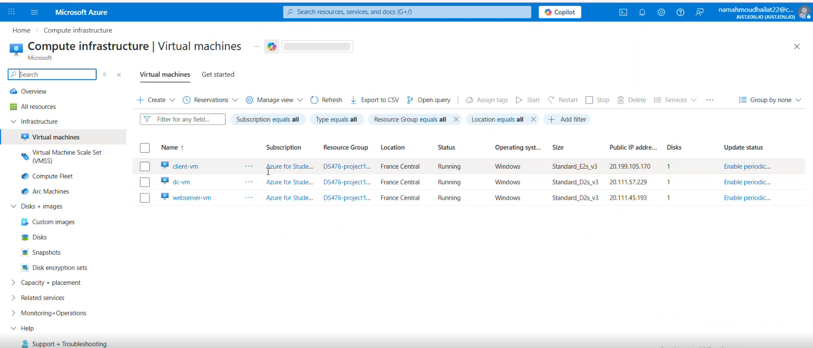
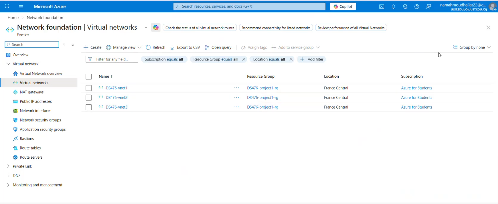
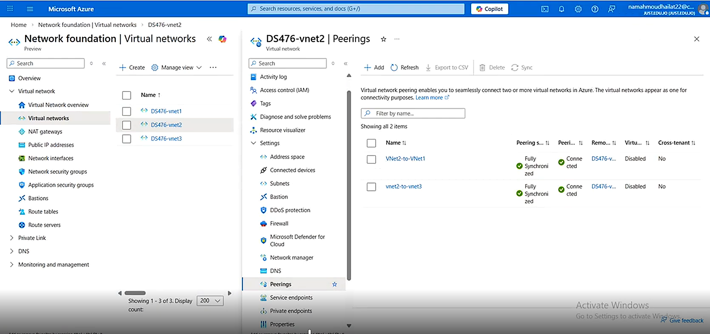
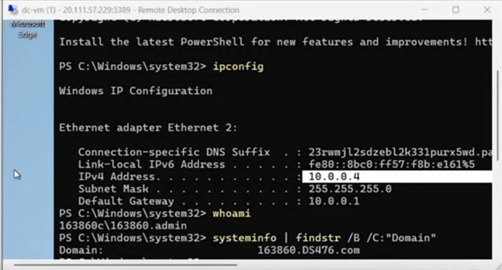
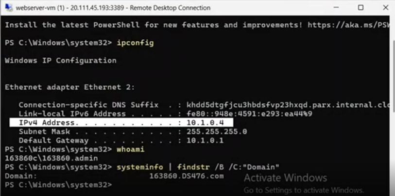
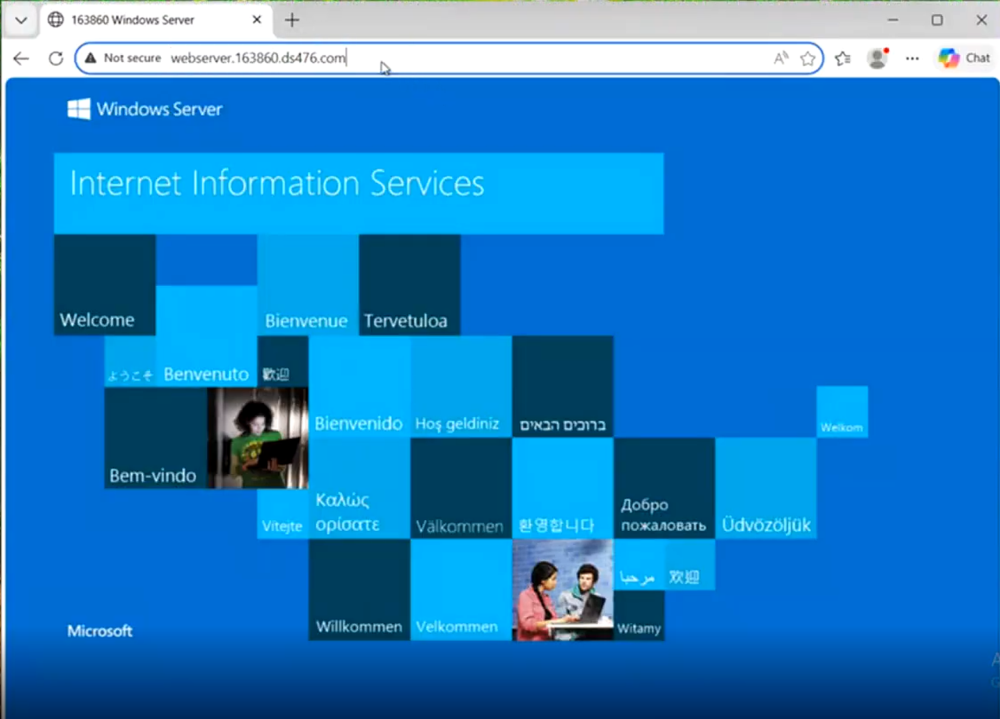

# Azure Cloud Infrastructure Project

This project demonstrates the implementation of a cloud infrastructure environment using Microsoft Azure and Active Directory Domain Services (AD DS).

## Project Overview
The project was designed to simulate a real-world enterprise network environment using Azure Virtual Networks, Virtual Machines, DNS, and Active Directory.

## Key Features
- Configured Azure Virtual Networks (VNets)
- Implemented Active Directory Domain Services (AD DS)
- Configured DNS and domain connectivity
- Created Virtual Network Peering between VNets
- Configured Azure Virtual Machines
- Implemented IIS Web Server

## Infrastructure Design
- **VNet1:** Domain Controller Network
- **VNet2:** Web Server Network
- **VNet3:** Client Machine Network

## Technologies Used
- Microsoft Azure
- Active Directory Domain Services (AD DS)
- DNS
- Virtual Machines (VMs)
- Virtual Network Peering
- IIS Web Server
- Windows Server

## Screenshots

### Azure Infrastructure

#### Virtual Machines

#### Virtual Networks

#### VNet Peering

**Note:** VNet peering was configured between all three virtual networks (DS476-vnet1, DS476-vnet2, and DS476-vnet3). This screenshot shows the peering configuration from DS476-vnet2.

### Domain Configuration

This screenshot shows the Domain Controller configuration and confirms the Active Directory domain:
`163860.DS476.com`

This screenshot shows that the web server VM is successfully joined to the Active Directory domain:
`163860.DS476.com`

### DNS Resolution
(Add screenshot here)

### Web Server

This screenshot demonstrates successful access to the IIS web server using the FQDN:
`webserver.163860.ds476.com`
